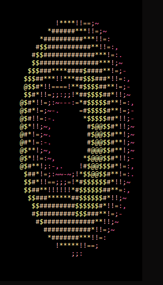
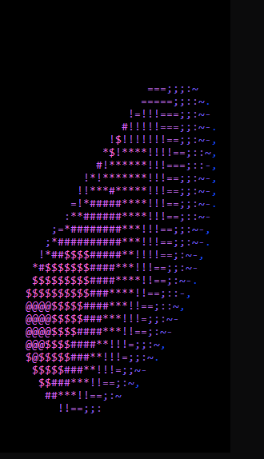

## Useless 80s Retro Spinning Donut

 

This is my second approach to implement [Spinning Donut](https://www.a1k0n.net/2011/07/20/donut-math.html). Previous version can be seen [here](https://github.com/Oyoshi/super-duper-ascii-based-spinning-donut). This time I choose Rust as my language for the learning purpose. Apart from that the project is completely useless as repository name suggests :trollface:. There are couple of reasons for that:

    1. it does literally nothing
    2. if you do not like 80s retro style it doesn't even look good

The donut can be rendered in two different color schemas: `DAY` and `NIGHT`. You can control it by passing proper arg to the program: `cargo run -- day` or `cargo run -- night`.

### References

1. https://www.a1k0n.net/2011/07/20/donut-math.html
2. https://en.wikipedia.org/wiki/ANSI_escape_code
3. https://doc.rust-lang.org/book/
